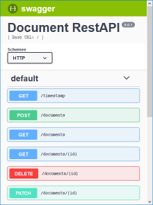
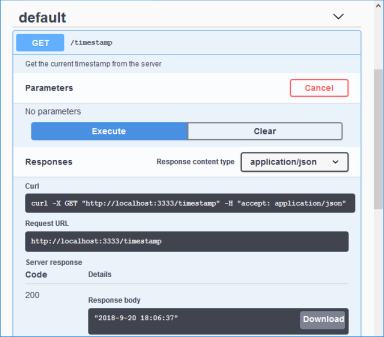
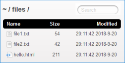

# swagger2-express-typescript
A template project for a RestAPI defined by Swagger (OpenAPI 2), running on Express and implemented via TypeScript


<!-- TOC depthFrom:2 depthTo:3 -->

- [1. Motivation and Goal](#1-motivation-and-goal)
- [2. Requirements](#2-requirements)
- [3. Installation and Usage](#3-installation-and-usage)
  - [3.1. Installation](#31-installation)
  - [3.2. Use the RestAPI](#32-use-the-restapi)
  - [3.3. Use Static Files](#33-use-static-files)
- [4. Using VSCode as IDE and Debugger](#4-using-vscode-as-ide-and-debugger)
- [5. Project structure](#5-project-structure)
- [6. Documentation how this project was set up](#6-documentation-how-this-project-was-set-up)
  - [6.1. Initialize as a NodeJS Project](#61-initialize-as-a-nodejs-project)
  - [6.2. Add dependencies](#62-add-dependencies)
  - [6.3. Add source files](#63-add-source-files)

<!-- /TOC -->

## 1. Motivation and Goal

The idea of this project is to have a seed project for setting up a RestAPI server which can be programmed in TypeScript. Unlike other projects, the RestAPI is defined by a `swagger.yaml` file which acts as a "single source of truth" for the API. The RestAPI end points are connected to functions defined in controller files. Unfortunatelly, there is no static typing for the parameters of the RestAPI in the controller files. The static typing begins when programming the services files which contain the actual business logic programmed in TypeScript.


## 2. Requirements

This is a NodeJS project (https://nodejs.org/). It was created using NodeJS v8.9.4 and was tested under NodeJS v10.11.0. It is possible (but not sure) that other versions could be used, too.


## 3. Installation and Usage

### 3.1. Installation

Download the ZIP-Archive and unpack it into your desired working folder. Change directory into the project root folder (e.g. where the file `package.json` is located) and run `npm install`. This will download and unpack all required packages (approx. 144 MByte) into the folder `node_modules`.

Open the file `package.json` in the project root folder and modify the entries for `"name"`, `"version"`, `"description"`, `"keywords"` and `"author"` accourding to your needs. If you also change the entry for `"license"`, you should also change the contenst of the file `LICENSE` in the project root folder.

### 3.2. Use the RestAPI

You can start the RestAPI web server by `npm start`. This will compile the source code files and start the server. When finished, you should see a message `Server fired up on http://localhost:3333`. Start a browser and direct it to http://localhost:3333/ (if you access the RestAPI from a different computer, replace "localhost" by the IP address or DNS name of the server running the RestAPI). This will display the Swagger UI which can be used to study and exercise the RestAPI:



Klick on the following buttons:
1. The first blue "GET" button (left to "/timestamp")
1. The "Try it out" button that shows up on the right side.
1. The blue "Execute" button that shows up below ist.

This sends a GET-request to the RestAPI, which responds with the current date and time of the server. You can see the response futher down at "Response body":



The other end points are placed around the "/documents" path. You can try the "POST", "GET", "DELETE" and "PATCH" buttons to generate new documents, request documents, delete and change them.

To keep it simple, the list of documents is stored in the main memory of the server. When you (re-)start the server, your changes are lost and the list is populated with three default documents.

You can stop the server by pressing <kbd>Ctrl</kbd>+<kbd>c</kbd> or by killing the corresponding NodeJS process.

Besides `npm start`, there are other commands to be used in the project. They are defined in `package.json` as follows:

| command line usage | Script Entry in package.json | description |
|:-------------------|:-----------------------------|:------------|
| `npm run start` <br>or `npm start` | "start" | compile the project and launch it in NodeJS |
| `npm run debug`                | "debug" | compile the project and launch it in NodeJS with the `--inspect` debug feature |
| `npm run build`                | "build" | compile the project but dont launch it |
| `npm run tsc`                  | "tsc"   | start the type script compiler, which is part of the build |


### 3.3. Use Static Files

You can acces the static files from the `dist/staticServerFiles/` folder via http://localhost:3333/files/:



When you add, change or remove files in the `src/staticServerFiles/` folder, you need to rebuild the project in order to have them copied over to the folder `dist/staticServerFiles/`. You can also write directly into the `dist/staticServerFiles/` during runtime. However, the folder will be deleted and re-initialized at every project build. You can turn this off by commenting out a line in the `copyStaticFiles.js` file as described further down in this document.


## 4. Using VSCode as IDE and Debugger

If you open the project root folder in VSCode (https://code.visualstudio.com/) you can use the following project specific commands (defined by files `launch.json` and `tasks.json` inside the `.vscode` folder):

* Command `Task: Run Build Task` or short key <kbd>Ctrl</kbd>+<kbd>Shift</kbd>+<kbd>b</kbd> will compile the project (same as the command `npm run build`). If there are any compiler errors, they will be listed in the "Problems" output window.
* Command `Debug: Start Debugging` or short key <kbd>F5</kbd> will compile the project and launch it inside the VSCode debugger. The TypeScript compiler is configured to generate source map files within the `dist` folder. Therefore, you can set breakpoints within the TypeScript files of the `src` folder.
Details for debugging in VSCode can be found at https://code.visualstudio.com/docs/editor/debugging.


## 5. Project structure

The following tree shows the folder and file structure of the project:

```text
ProjectRootFolder
│   .gitignore
│   copyStaticFiles.js
│   LICENSE
│   package-lock.json
│   package.json
│   README.md
|   screenshot-1.png
|   screenshot-2.png
|   screenshot-3.png
│   tsconfig.json
├───.vscode
│       launch.json
│       tasks.json
├───dist
│   ├───...
├───node_modules
│   ├───...
└───src
    │   app.ts
    ├───api
    │   ├───controllers
    │   │       documents.ts
    │   │       timestamp.ts
    │   └───swagger
    │           swagger.yaml
    ├───config
    │       default.yaml
    │       README.md
    ├───services
    │       documents.ts
    └───staticServerFiles
            file1.txt
            file2.txt
            hello.html
```

The four folders in the project are `src`, `dist`, `node_modules` and `.vscode`:
* `src` includes the source code files of the project, mainly in TypeScript, JavaScript and YAML.
* `dist` contains the resulting files, when the project is built (for "distribution").
* `node_modules` contains all modules, packages and libraries needed besides the source files to run the project.
* `.vscode` contains `launch.json` and `tasks.json`: `tasks.json` describes to VSCode how to build the project when the command `Task: Run Build Task` or the short key <kbd>Ctrl</kbd>+<kbd>Shift</kbd>+<kbd>b</kbd> is selected. `lauch.json` describes for VSCode how to build the project and launch it inside the VSCode-Debugger when <kbd>F5</kbd> is pressed.

The files in the project root folder are:
* `.gitignore` defines what files and folders shall not be included in the git repository, mainly the `node_modules` folder (contents is fetched from the internet via `npm install`) and the `dist` folder (should be built from the project's source code files).
* `copyStaticFiles.js` is used to copy specific non-TypeScript files from the `src` to the `dist` folder (e.g. the important `swagger.yaml` file).
* `LICENSE` contains the MIT license used for this project
* `package-lock.json` describes the tree of packages and modules that are installed in the `node_modules` folder. It is automatically updated when packages are added or removed via npm.
* `package.json` is the main project- and configuration-file for every NodeJS project.
* `README.md` is the main documentation file for the project (using the browser screen shots `screenshot-1.png`, `screenshot-2.png` and `screenshot-3.png`).
* `tsconfig.json` contains configuration entried for the TypeScript compiler "tsc", e.g. where source code files reside and where to put the compiled output files.

The source code files are located in the `src` folder:
* `src/app.ts` is the main entry point for the RestAPI server app.
* `src/config/default.yaml` is used to configure the Swagger tools, e.g. where to find the RestAPI controller files and that the `swagger_params_parser` shall be used. The file can be extended for other configuration entries of the project. Details can be found at https://www.npmjs.com/package/config.
* `src/api/swagger/swagger.yaml` is the specification file for the RestAPI. It defines API end points, http methods (get, post, ...), parameters and possible responses including response codes and data structures. It also links the end points to handler functions in the controller files. In this project, this file is the single source of truth for the entire RestAPI.
* `src/api/controllers/` is a folder that holds all controller files for the RestAPI. In the current project this is `documents.ts` and `timestamp.ts`.
* `src/services/` is a folder that contains the source code files for the business logic in the background. For example, `documents.ts` contains the functionality for handling a list of documents, like fetching a specific or all documents, as well as adding, removing and modifying documents.
* `src/staticServerFiles/` contains files which are staticyally served. They can be accessed via http://localhost:3333/files/.

&nbsp;

## 6. Documentation how this project was set up

Just in case you want to gain deeper insight about how this project is put together, you may take a look at the following section.

### 6.1. Initialize as a NodeJS Project

Run `npm init -y` and modify the resulting file `package.json` as follows:

```json
{
  "name": "swagger2-express-typescript",
  "version": "1.0.0",
  "description": "A template project for a RestAPI defined by Swagger (OpenAPI 2), running on Express and implemented via TypeScript",
  "main": "dist/app.js",
  "scripts": {
    "start": "npm run build && node dist/app.js",
    "debug": "npm run build && node --inspect dist/app.js",
    "build": "node copyStaticFiles.js && npm run tsc",
    "tsc": "tsc"
  },
  "keywords": [
    "Swagger",
    "Express",
    "JavaScript",
    "RestAPI"
  ],
  "author": "Georg Braun",
  "license": "MIT"
}
```

### 6.2. Add dependencies

#### TypeScript

Typescrip adds about 40 MByte to the project folder (approx. 0 MByte before and 40 MByte after).

```bash
npm install --save-dev typescript @types/node
```

Add a new file `tsconfig.json` to the project root folder with the following contents:

```json
{
  "compilerOptions": {
      "module": "commonjs",
      "esModuleInterop": true,
      "target": "es6",
      "noImplicitAny": true,
      "moduleResolution": "node",
      "sourceMap": true,
      "outDir": "dist",
      "baseUrl": ".",
      "paths": {
          "*": [
              "node_modules/*",
              "src/types/*"
          ]
      }
  },
  "include": [
      "src/**/*"
  ],
  "exclude": [
      "node_modules"
  ]
}
```


#### Express

Express is the web framework used to run the server.

It adds about 2 MByte to the project folder (approx. 40 MByte before and 42 MByte after).

```bash
npm install --save express
npm install --save-dev @types/express
```

#### Swagger

The package "swagger-express-mw" provides the swagger functionality. It is key for building and running the RestAPI end points dynamically from a specification file called `swagger.yaml`.

This package adds about 92 MByte to the project folder (approx. 42 MByte before and 134 MByte after).

```bash
npm install --save  swagger-express-mw
npm install --save-dev @types/swagger-express-mw @types/swagger-node-runner
```


#### Swagger UI Express

The package "swagger-ui-express" builds a nice html-view of the RestAPI including "Try it out"-Buttons to exercise and test the RestAPI. The package "js-yaml" is used to parse the Swagger-API-Spec-YAML-file and return it as a JavaScript object.

Both packages adds about 9 MByte to the project folder (approx. 134 MByte before and 143 MByte after).

```bash
npm install --save swagger-ui-express js-yaml
npm install --save-dev @types/swagger-ui-express @types/js-yaml
```


#### ShellJS

ShellJS provides Linux-commands in a JavaScript file. I this project, it is used to execute the file `copyStaticFiles.js` (see below) that copies specific non-TypeScript files from the `src` to the `dist` folder.

It adds about 1 MByte to the project folder (approx. 143 MByte before and 144 MByte after).

```bash
npm install --save-dev shelljs @types/shelljs
```

Add a new file `copyStaticFiles.js` to the project root folder with the following contents:

```javascript
'use strict';

const shell = require('shelljs');

// Create target folder 'dist' if it does not exist:
if(!shell.test('-e', 'dist')) { shell.mkdir('dist'); }

// Delete old config files and copy from src folder:
shell.rm('-rf', 'dist/config');
shell.cp("-R", "src/config", "dist/config/");

// Create target folder 'dist/api' if it does not exist:
if(!shell.test('-e', 'dist/api')) { shell.mkdir('dist/api'); }

// Delete old swagger files and copy from src folder:
shell.rm('-rf', 'dist/api/swagger');
shell.cp("-R", "src/api/swagger", "dist/api/swagger/");

// Delete old static server files and copy newer ones:
shell.rm('-rf', 'dist/staticServerFiles');
  // Remove the above line in case you want to keep files generated by the server during runtime
shell.cp("-R", "src/staticServerFiles", "dist/staticServerFiles/");
```

This file is used by the `build` script inside the `package.json` file. Please note the `// Remove the above line ...` comment at the end of the file.

#### Serve Index

The package "serve-index" is used to generate an html-page that lists static files in a certain folder and offers them for download.

This adds less than 1 MByte to the project folder (approx. 144 MByte before and 144 MByte after).

```bash
npm install --save serve-index
npm install --save-dev @types/serve-index
```


### 6.3. Add source files

Source files are added in the `src` folder. A more detailed description can be found further up in this document.

